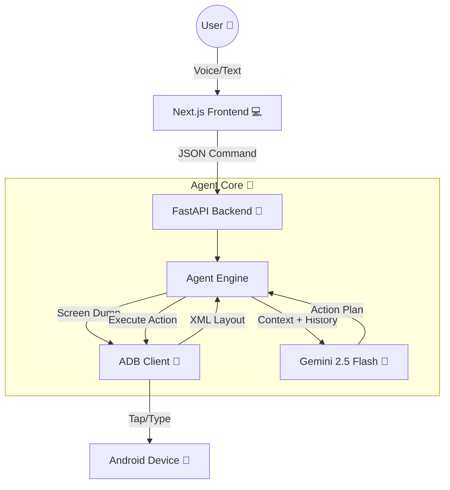

# 🤖 AI Mobile Automation Agent

> **Control your Android device using natural language and voice commands.**  
> Powered by **Gemini 2.5 Flash**, **Appium/ADB**, and a **Dynamic ReAct Loop**.

 

## 📖 Overview
This project essentially turns an LLM into an Android operator. Instead of hard-coded scripts, it uses a **Vision-Driven ReAct Agent** that:
1.  **Observes** the screen (XML dumping).
2.  **Reasons** about what to do next.
3.  **Acts** (taps, types, scrolls) via ADB.
4.  **Learns** from the result and repeats.

---

## 🏗️ Architecture



## ✨ Key Features
- **🗣️ Voice Control**: Speak commands directly via the Web UI (Web Speech API).
- **🧠 Dynamic ReAct Loop**: The agent adapts to unexpected popups or UI changes.
- **👀 Vision Capabilities**: Reads the screen structure to find buttons by text/description.
- **🛡️ Rate Limit Handling**: Smartly pauses when API quotas are hit.
- **⚡ Real-Time execution**: Low-latency communication with local devices.

---

## 🛠️ Prerequisites

Before you start, ensure you have:

| Component | Version | Notes |
|-----------|---------|-------|
| **Node.js** | v18+ | For the frontend UI |
| **Python** | v3.10+ | For the backend agent |
| **Android SDK** | Latest | specifically `platform-tools` (adb) |
| **Android Device** | Android 10+ | Real phone (USB Debugging ON) or Emulator |

---

## 🚀 Installation

### 1. Clone the Repository
```bash
git clone https://github.com/Ujjwal120605/assignment.git
cd assignment
```

### 2. Backend Setup
```bash
cd backend
python3 -m venv venv
source venv/bin/activate  # Windows: venv\Scripts\activate
pip install -r requirements.txt
```

**Configuration**:
Create a `.env` file in `backend/` containing your API key:
```env
GEMINI_API_KEY=AIzaSy...
```

### 3. Frontend Setup
Open a new terminal in the root directory:
```bash
npm install
```

---

## ⚡ Usage

### 1. Connect Device
Connect your Android phone via USB and enable **USB Debugging**.
```bash
adb devices
# Output should show: List of devices attached -> <serial> device
```

### 2. Start Servers
**Backend** (Terminal 1):
```bash
cd backend
source venv/bin/activate
uvicorn main:app --host 0.0.0.0 --port 8000 --reload
```

**Frontend** (Terminal 2):
```bash
npm run dev
```

### 3. Command & Conquer
Open `http://localhost:3000` in your browser.

- **Click the Mic 🎤**: Say "Open YouTube and play a lofi video".
- **Type ⌨️**: "Open Settings and find my IMEI number".
- **Watch 📱**: The agent will take control of your phone!

---

## 🔧 Troubleshooting

### Device Not Found?
- **Check Cable**: Ensure the USB cable supports data transfer.
- **USB Debugging**: Must be enabled in Developer Options.
- **Restart ADB**: `adb kill-server && adb start-server`.

### Agent is "Blind" (Found 0 elements)?
- Some banking/secure apps block screen reading. The agent cannot see these screens.
- Ensure the device screen is **UNLOCKED** and awake.

### "Failed to Fetch" Error?
- Ensure the Backend is running on port `8000`.
- Check if you have any firewall blocking `localhost`.

### API Rate Limit?
- The agent handles this automatically! It will pause and retry.
- Consider upgrading to a paid API tier for faster execution.

---

## 📜 License
This project is open-source under the MIT License.
